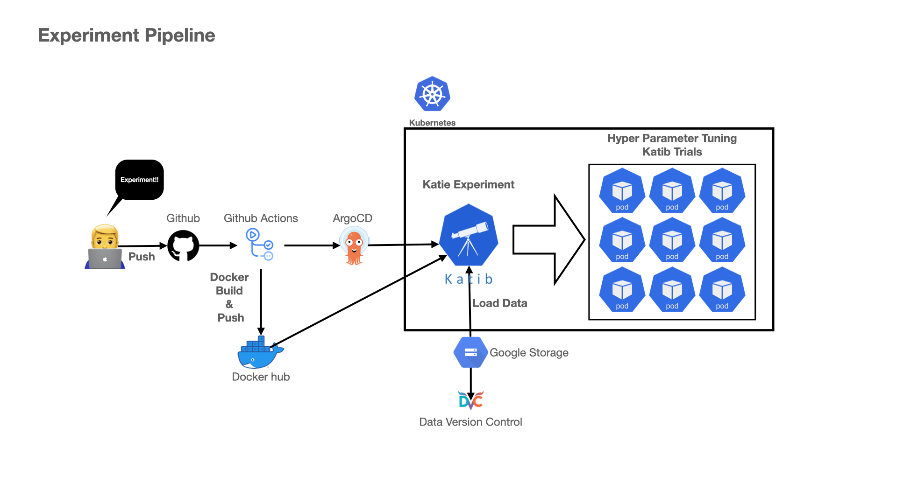

# Katib 를 통해 수행하는 실험 파이프라인

**Diagram**



**순서도**

1. <ins>개발자 `train.py` 를 Github Repository에 Push</ins>
2. <ins>Github Action을 통해 수행되는 Docker build & push</ins>
3. <ins>ArgoCD가 바라보고 있는 Deploy Repository Update with tag</ins>
4. ArgoCD가 Kubernetes에 `train-experiment.yaml` 실행 
5. Slack Alert


현재 레포지토리에서 수행하는 Task는 1, 2, 3입니다.

<br/>

## 1. train.py

Katib로 HPO를 수행하기 위해 2가지 신경써야 할 부분이 있습니다.

1. 하이퍼 파라미터 입력
2. 메트릭 저장을 위한 출력


**1. 하이퍼 파라미터 입력**

모델 학습을 위한 코드에서 하이퍼 파라미터 튜닝을 원하는 Argument을 `argparse` 를 통해 지정해야합니다.

example)

```python
import argparser


def get_args():
    parser = argparse.ArgumentParser()
    parser.add_argument("--hidden_units", type=int, required=True)
    parser.add_argument("--optimizer", type=str, required=True)

    args = parser.parse_args()
    return args
```

**2. 메트릭 저장을 위한 출력**

Katib로 HPO 수행을 위해선 Metrics Collector를 정의해야합니다. 이때 StdOut을 사용할 것입니다. StdOut 방식의 사용법은 간단합니다. 파이썬의 `print` 를 통해 `{key}={value}` 를 맞춰 출력하도록 하면됩니다.

example)

```python
print(f"model acc={acc:.4f} loss={loss:.4f}")
```

위의 예시는 acc라는 key값에 acc가 소수점 네번째자리까지의 값이 저장될 것입니다. (loss도 마찬가지)

<br/>

## 2. Github Actions Docker

특정 Commit에 버전을 정의하고자 할 때 Tag를 지정한 뒤 업로드할 수 있습니다. 

Tag가 업로드 되면 Github Actions가 실행됩니다. Github Actions가 자동으로 수행하는 일들은 다음과 같습니다.

1. 현재 레포지토리 복제
2. 이미 정의된 Dockerfile 기반으로 `train.py` 를 도커 이미지로 빌드
3. `ghcr`로 도커 이미지 업로드

<br/>

## 3. Github Actions Update Tag

2번과 이어지는 내용이지만 역할이 다르다 판단하며 분리하였습니다. 

도커 이미지가 업로드 되면 Kubernees로의 Deploy를 담당하는 Repogitory의 `train-experiment.yaml` 을 업데이트합니다. 그렇게 되면 ArgoCD가 해당 레포지토리를 바라보고 있으므로 자동으로 Katib를  통해 HPO Experiment가 시작됩니다.


